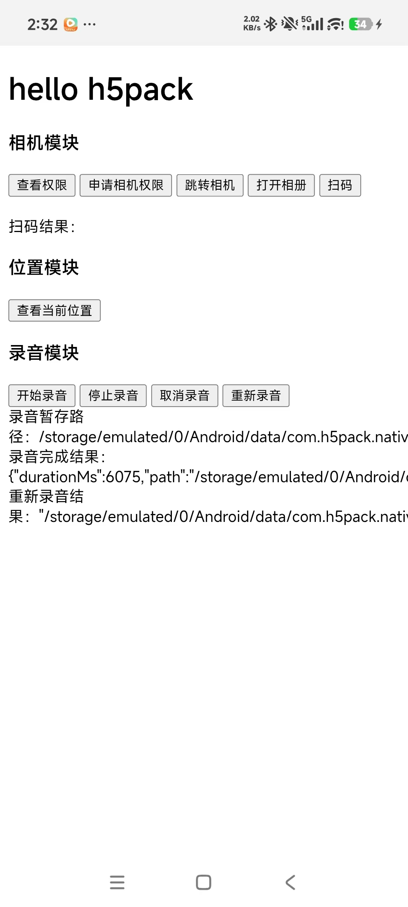

# Camera

调用原生平台麦克风/录音模块的能力。

<details>
  <summary>点击查看示意图</summary>
  
</details>

## checkPermission

查看是否拥有麦克风权限

- 类型

```typescript
checkPermission(): Promise<boolean | void>;
```

- 使用

```typescript
h5packBridge.recordAudio.checkPermission().then(res => {
	console.log('checkPermission', res)
})
```

## requestPermission

申请麦克风权限。（调用之后 App 会有权限申请的弹窗）

- 类型

```typescript
requestPermission(): Promise<unknown>;
```

- 使用

```typescript
h5packBridge.recordAudio.requestPermission().then(res => {
	console.log('requestPermission', res)
})
```

## start

打开麦克风录音

- 类型

```typescript
export type StartOptions = {
	fileName?: string
	sampleRate?: number
	bitRate?: number
}

/**
 * 开始录音
 * @param options 录音选项
 * @returns 录音暂存路径
 */
start(options?: StartOptions): Promise<string>;
```

- 使用

```typescript
h5packBridge.recordAudio.start().then(res => {
	console.log('开始录音res', res)
})
```

## stop

停止录音

- 类型

```typescript
export type StopResult = {
	path: string
	durationMs: number
}
/**
 * 停止录音
 * @returns 录音暂存路径和录音时长
 */
stop(): Promise<StopResult>;
```

- 使用

```typescript
h5packBridge.recordAudio.stop().then(res => {
	console.log('停止录音res', res)
})
```

## cancel

取消录音

- 类型

```typescript
/**
 * 取消录音
 */
cancel(): Promise<void>;
```

- 使用

```typescript
h5packBridge.recordAudio.cancel().then(res => {
	console.log('取消录音res', res)
})
```

## restart

重新开始录音

- 类型

```typescript
export type StartOptions = {
	fileName?: string
	sampleRate?: number
	bitRate?: number
}

/**
 * 重新录音
 * @param options 录音选项
 * @returns 录音暂存路径
 */
restart(options?: StartOptions): Promise<string>;
```

- 使用

```typescript
h5packBridge.recordAudio.restart().then(res => {
	console.log('重新开始录音res', res)
})
```
