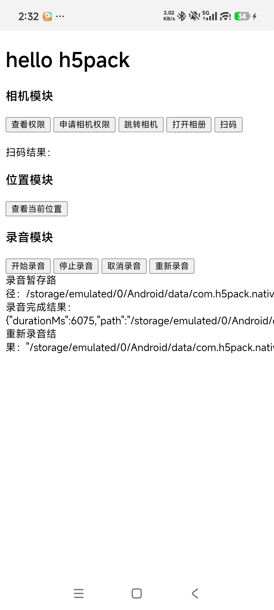

# RecordAudio

调用原生平台麦克风/录音模块的能力。

<details>
  <summary>点击查看示意图</summary>
  
</details>

## 类型定义

```typescript
type StartOptions = {
    fileName?: string;
    sampleRate?: number;
    bitRate?: number;
};

type StopResult = {
    path: string;
    durationMs: number;
};

/**
 * 权限申请结果状态
 * - granted: 已授权
 * - denied: 被拒绝（可再次申请）
 * - never_ask_again: 被永久拒绝（需引导用户去设置页）
 */
type PermissionStatus = 'granted' | 'denied' | 'never_ask_again';

type PermissionResult = {
    granted: boolean;
    status: PermissionStatus;
};
```

---

## 权限管理

以下 API 需要 `RECORD_AUDIO` 权限，请确保 `h5pack.json` 中已配置 `"nativePermission": ["RECORD_AUDIO"]`。

### checkPermission

查看是否拥有麦克风权限

- 类型

```typescript
checkPermission(): Promise<boolean | void>;
```

- 使用

```typescript
h5packBridge.recordAudio.checkPermission().then(res => {
	console.log('checkPermission', res)
})
```

### requestPermission

申请麦克风权限。（调用之后 App 会有权限申请的弹窗）

返回结果包含 `granted` 和 `status` 字段，可区分三种状态：
- `granted`: 已授权
- `denied`: 被拒绝（可再次申请）
- `never_ask_again`: 被永久拒绝（需引导用户去设置页手动开启）

- 类型

```typescript
requestPermission(): Promise<PermissionResult | void>;
```

- 使用

```typescript
h5packBridge.recordAudio.requestPermission().then(res => {
    if (res?.granted) {
        console.log('已获得麦克风权限')
    } else if (res?.status === 'never_ask_again') {
        // 需要引导用户去设置页
        h5packBridge.recordAudio.openAppSettings()
    } else {
        console.log('用户拒绝了麦克风权限')
    }
})
```

### openAppSettings

跳转应用详情设置页。用于权限被永久拒绝（`never_ask_again`）时引导用户手动开启权限。

- 类型

```typescript
openAppSettings(): void;
```

- 使用

```typescript
h5packBridge.recordAudio.openAppSettings()
```

---

## 录音

### start

打开麦克风录音

- 类型

```typescript
start(options?: StartOptions): Promise<string>;
```

- 使用

```typescript
h5packBridge.recordAudio.start().then(res => {
	console.log('开始录音res', res)
})
```

- 错误处理

```typescript
try {
    const res = await h5packBridge.recordAudio.start()
} catch (error) {
    switch (error.code) {
        case 'RECORD_AUDIO_PERMISSION_DENIED':
            // 权限被拒绝，可再次申请
            break
        case 'RECORD_AUDIO_PERMISSION_NEVER_ASK_AGAIN':
            // 权限被永久拒绝，引导用户去设置页
            h5packBridge.recordAudio.openAppSettings()
            break
        default:
            console.error('录音失败:', error.message)
    }
}
```

## stop

停止录音

- 类型

```typescript
stop(): Promise<StopResult>;
```

- 使用

```typescript
h5packBridge.recordAudio.stop().then(res => {
	console.log('停止录音res', res)
})
```

## cancel

取消录音

- 类型

```typescript
cancel(): Promise<void>;
```

- 使用

```typescript
h5packBridge.recordAudio.cancel().then(res => {
	console.log('取消录音res', res)
})
```

## restart

重新开始录音

- 类型

```typescript
restart(options?: StartOptions): Promise<string>;
```

- 使用

```typescript
h5packBridge.recordAudio.restart().then(res => {
	console.log('重新开始录音res', res)
})
```

---

## 错误码

| 错误码 | 说明 | 建议处理方式 |
|---|---|---|
| `RECORD_AUDIO_PERMISSION_DENIED` | 麦克风权限被拒绝（可再次申请） | 可重新调用 `requestPermission()` |
| `RECORD_AUDIO_PERMISSION_NEVER_ASK_AGAIN` | 麦克风权限被永久拒绝 | 调用 `openAppSettings()` 引导用户手动开启 |
| `RECORD_AUDIO_ERROR` | 录音操作失败 | 提示用户稍后重试 |
| `PERMISSION_CHECK_ERROR` | 权限检查失败 | 系统异常，提示用户稍后重试 |
| `PERMISSION_REQUEST_ERROR` | 权限申请失败 | 系统异常，提示用户稍后重试 |
